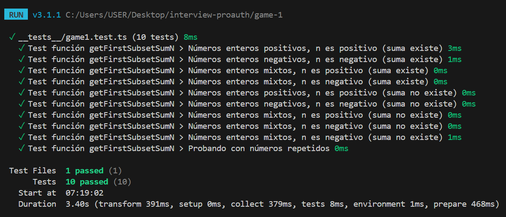
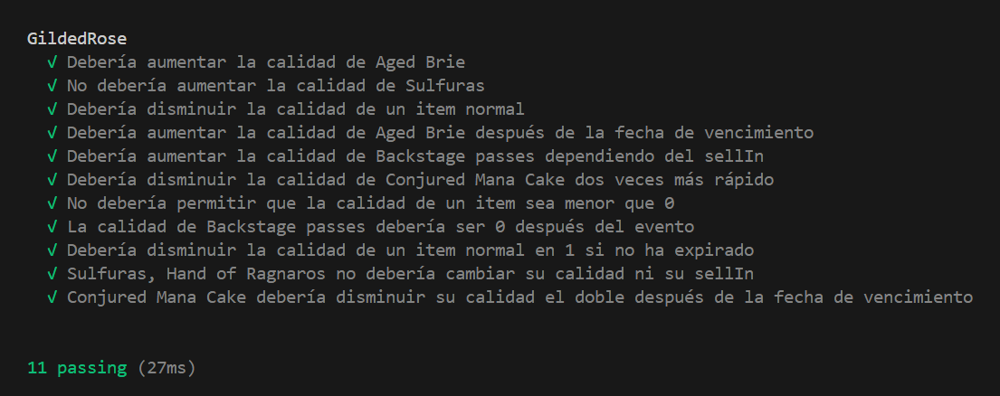

<h1 align="center">Soluciones al Challengue-PreAuth 🚀</h1>

Este repositorio contiene una solución para los 2 juegos (retos) propuestos por Pre-Auth. Ambas soluciones están implementadas en **TypeScript** y se incluyen ejemplos de prueba para verificar su funcionamiento.

## Primer juego

### Descripción

La función `getFirstSubsetSumN` encuentra el primer par de números en un conjunto de enteros que sumen un valor `n` dado. Si se encuentra dicho par, la función lo devuelve como un array de dos números. Si no se encuentra ningún par que cumpla con la condición, devuelve `null`.

### Funcionamiento

1. **Entrada**: Un array de números enteros y un valor `N` al cual se desea llegar mediante la suma de dos números del array.
2. **Proceso**: Se recorre el array M, para cada número, se verifica si su complemento (es decir, `n - num`) ya ha sido visto anteriormente en el array utilizando un `Map`.
3. **Salida**: Devuelve el primer par de números cuya suma sea igual a `n`, o `null` si no se encuentra ningún par.

### Ejemplo

```typescript
const result = getFirstSubsetSumN([2, 5, 8, 14, 0], 10);
console.log(result); // [2, 8]
```

### Tests

Para ejecutar los tests, usa el siguiente comando:

```bash
cd ./game-1
npm test
```

### Resultados

Vitest mostrará los resultados de las pruebas en la terminal. Si todo está correcto, deberías ver un mensaje de éxito para cada prueba. Si alguna prueba falla, se te brindará detalles sobre qué prueba no pasó y por qué.

- Ejemplo
  

### Complejidad

- Tiempo: O(n), ya que el array se recorre una vez y las operaciones en el Map son O(1).

- Espacio: O(n), debido al uso del Map para almacenar los números ya vistos.

## Segundo juego

### Descripción

Este segundo juego contiene un refactor a la clase GildedRose en específico, su método `updateQuality`, donde se implementó constantes en los tipos de ítem para evitar Magic Strings, además de desacoplar cada caso en un método de la clase, de esta manera cada lógica está en su propia función ofreciendo un contexto específico.

### Reglas de Actualización

1. **Productos comunes**: La calidad de estos productos disminuye con el tiempo. Si el producto pasa su fecha de vencimiento (`sellIn`), la calidad disminuye el doble.
2. **Aged Brie**: Este producto aumenta su calidad con el tiempo.
3. **Backstage passes**: La calidad aumenta dependiendo de los días restantes para el evento. Después del evento, la calidad es 0.
4. **Sulfuras**: Este es un producto legendario cuya calidad no disminuye y no tiene fecha de vencimiento.
5. **Conjured**: La calidad de estos productos disminuye el doble de rápido.

### Algoritmo

- **Entrada**: Un conjunto de productos representados por instancias de la clase `Item`.
- **Proceso**: La función recorre el array de productos y actualiza el valor de `sellIn` y `quality` de acuerdo con las reglas descritas.
- **Salida**: El array actualizado de productos.

### Tests

Puedes ejecutar los tests utilizando Mocha para verificar el comportamiento de la función updateQuality:

```bash
cd ./game-2
npm test
```

### Resultados

Mocha mostrará los resultados de las pruebas en la terminal. Si todo está correcto, deberías ver un mensaje de éxito para cada prueba. Si alguna prueba falla, se te brindará detalles sobre qué prueba no pasó y por qué.

- Ejemplo
  

### Mejora continua
* Se utilizo el patrón Abstract Factory para el desacoplamiento de la lógica de actualización de calidad para cada item; de esta manera, se pemitirá mayor control y organización para nuevos tipos de item en el futuro.